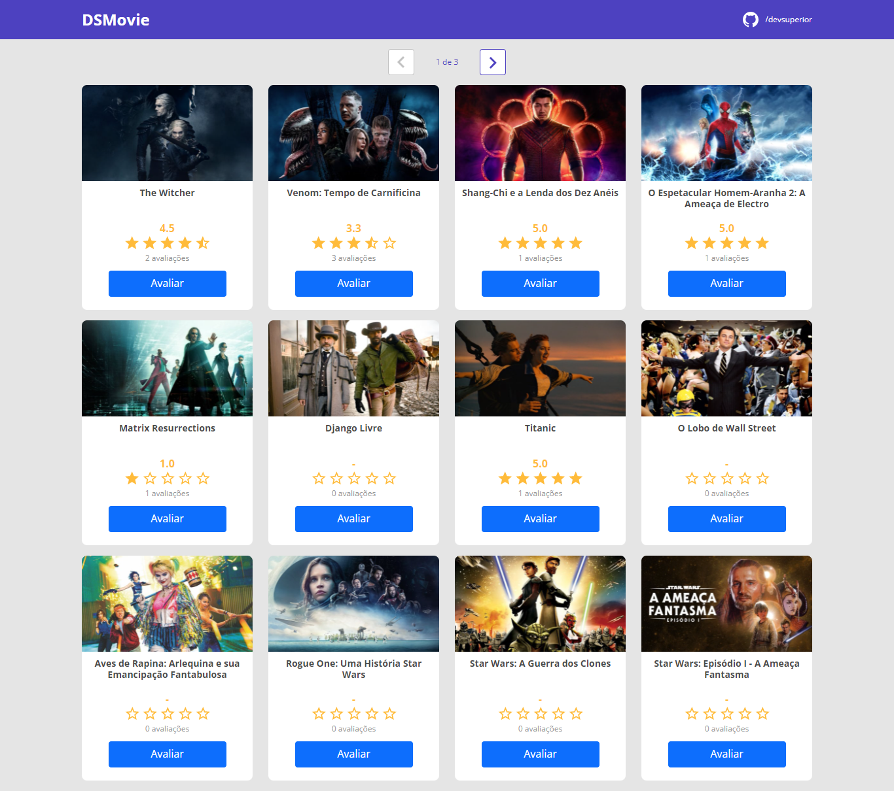

# dsmovie
<h1 align="center">
    
</h1>
<h4 align="center"> 
	🚧 🚀 Concluído... 🚧
</h4>

  
  
  
  
  

### 💻 Sobre o projeto
O Dsmovie é um projeto desenvolvido por mim guiado pela escola devsuperior na qual participei de seu bootcamp semanaSpring react e desencolci essa aplicação web utilizando react .
### 🛠 Tecnologias

As seguintes ferramentas foram usadas na construção do projeto:

- [HTML5](https://www.devmedia.com.br/o-que-e-o-html5/25820) 
- [CSS](https://developer.mozilla.org/pt-BR/docs/Web/CSS0) 
- [Bootstrap](https://pt.wikipedia.org/wiki/Bootstrap_(framework_front-end)) 
- [Node.js](https://nodejs.org/en/)
- [React](https://pt-br.reactjs.org/)
- [Java](https://pt.wikipedia.org/wiki/Java_(linguagem_de_programa%C3%A7%C3%A3o))

</table>
